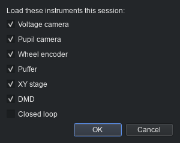
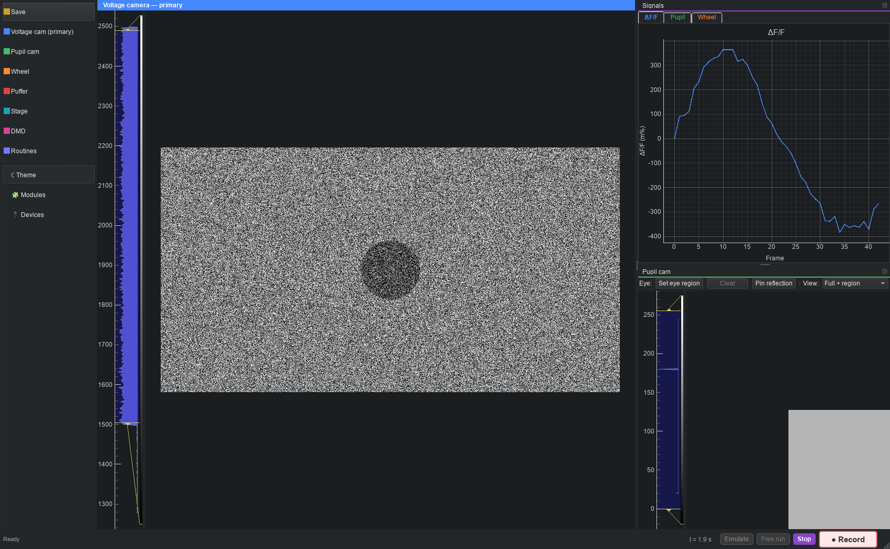
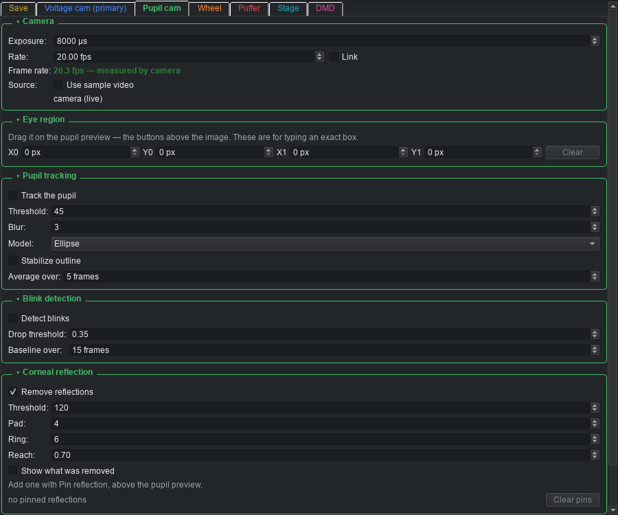
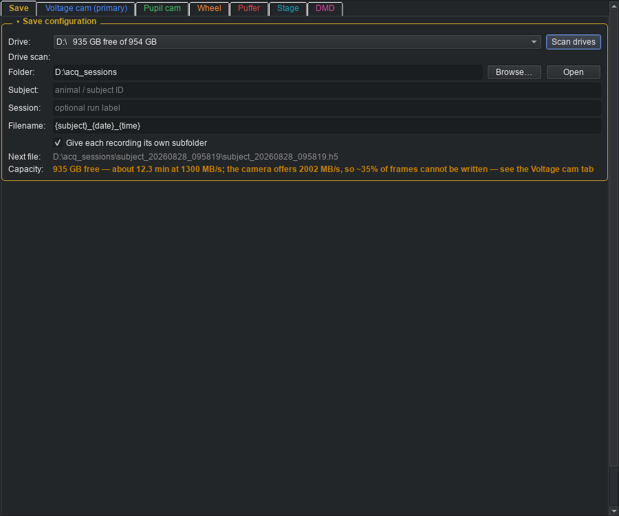
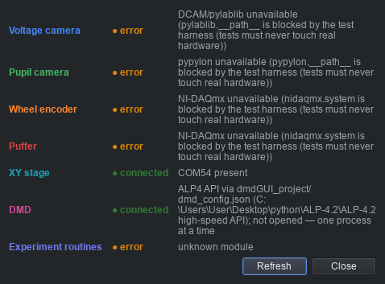
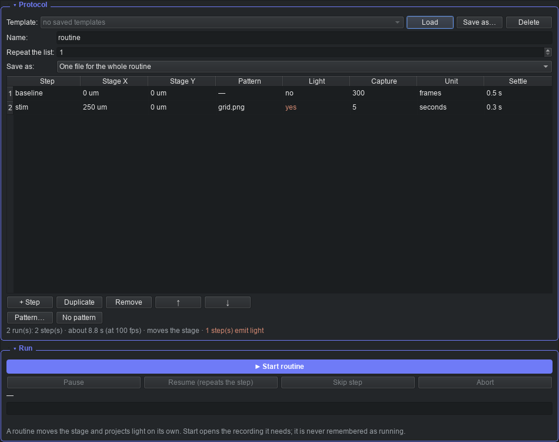

# acqApp — Operator Quick-Start

A practical walkthrough of running a session: launch, pick instruments,
configure one, go live, record, and where the file ends up. For what the app
*is* and how it's built, see [README.md](../README.md); for what's planned or
in progress, see [PLAN.md](../PLAN.md).

Screenshots below are from a mock session (no rig hardware attached), so
frame previews show synthetic noise instead of a real image — the layout and
controls are identical on the rig.

## 1. Launching

```
acqApp\.venv\Scripts\python acqApp\main.py
```

No setup needed the first time — `main.py` creates `acqApp\.venv` if it's
missing and installs everything into it. Add `--mock` to run with no hardware
attached (simulated signals in place of every device) — useful for practicing
away from the rig.

## 2. Pick what to load



Tick which instruments to load this session. It defaults to whatever you had
loaded last time. **Experiment routines** has no checkbox — it owns no
device, so there's nothing to unload.

You aren't locked in: the sidebar's **🧩 Modules** button reopens this same
picker at any time, and loading or unloading applies live — a module you add
mid-session builds its own worker and joins the live view immediately. The
only time it's refused is **while recording**, so a stream can't appear or
vanish partway through a file.

## 3. The main window



- **Left sidebar** — one item per loaded instrument's settings page (plus
  **Save**), each in its own accent colour. Below the divider: **Theme**,
  **Modules** (the picker again), **Devices** (§6).
- **Centre** — the voltage camera's live preview, when loaded; otherwise
  whatever module claims the central view.
- **Right** — the **Signals** dock: rolling plots per instrument, tabbed.
  The pupil camera additionally gets its **own dock** (bottom right here)
  with the live frame, the fitted pupil outline, the eye region, and any
  pinned reflections.
- **Bottom status bar** — session clock, recording readout, then
  **Emulate** / **Live view** / **● Record**.

Every dock and plot panel is **draggable** — pull one out to float it, tab it
with another, or re-dock it elsewhere. The layout is remembered across runs.

### Starting a session

- **Live view** starts the shared session clock and every loaded worker,
  with preview but nothing saved to disk. Good for framing, focusing,
  checking a signal.
- **● Record** does the same and additionally streams every sample to one
  HDF5 file (starting Live first if it wasn't already running).
- **Emulate** swaps every device for its mock twin — flip it on to rehearse
  or test with no hardware attached, same as `--mock` at launch but
  toggleable per session.
- To check one instrument in isolation, tick only that module in the startup
  picker and press **Live view** — the rest of the session machinery still
  runs, but there is nothing else loaded for it to synchronize with.

## 4. Configuring an instrument

Click any sidebar item to open the shared settings window on that page — a
tab bar across the top mirrors the sidebar, and both stay in sync. Clicking
the sidebar item you're already on tucks the window away again. It's a
separate window, so it can sit on a second monitor while a session runs.

**Example — the pupil camera's page:**



A few things worth knowing about this one, since they aren't typed as
numbers:

- **Eye region** — drag a box directly on the pupil preview dock (not here);
  these fields just show/type the box you already drew.
- **Rate / Exposure Link** — check it to keep the two locked together
  (exposure = 1/rate); unchecked, Rate is just a ceiling on Exposure.
- **Stabilize outline** and **Detect blinks** trade a little lag for a
  steadier trace and a flagged-blink overlay on the radius plot,
  respectively — both off by default so a session captures the raw fit
  unless you opt in.
- **Pin reflection** (button above the preview, not shown here) marks a
  fixed IR glint for removal — there's no separate button for it in this
  settings page on purpose; it's a position in the frame, so it's placed by
  clicking the frame.

Every panel's settings **persist** to `acqapp_local.json` and come back at
the next launch — except runtime-only state like the eye-tracking LED, which
always starts off so the app can never come up with an illuminator already
on.

### Where the data goes — the Save tab



Pick the destination drive and folder, a subject ID, and a filename template
(`{subject}`, `{session}`, `{date}`, `{time}`). The **Next file** line always
shows the exact path the next recording will get — a name that already
exists is auto-numbered, never overwritten.

The **Capacity** line is the one to actually read before a long session: it
compares the free space and the configured data rate, and — as in the
screenshot above — will tell you plainly if the current configuration can't
actually be written to disk fast enough, with a pointer to the tab that can
fix it. If a drive looks slower than it should, hit **Scan drives**: it
benchmarks each one directly rather than trusting what the OS reports.

## 5. Checking device connections



The sidebar's **Devices** item opens a live probe of every loaded
instrument — safe to open any time, including mid-session, since it only
*enumerates* (checks presence), never opens a device for real. On the rig,
instruments that are plugged in and powered read **connected**; the example
above is from a dev machine with none of the rig hardware attached, so
almost everything reads **error** — that's expected there, not a fault.

A **connected** probe is not the same as *working*: it means the OS can see
the device, not that acqApp has successfully opened and driven it.

## 6. Running an experiment routine



**Experiment routines** is always loaded and opens in a window of its own
(not a settings-page tab), reachable from the sidebar. A routine is a list
of steps — *move the stage here, put this pattern up, capture this
long* — run in order, for as many cycles as you set.

Add steps with **+ Step**, edit a cell directly (each field is a proper
widget — a dropdown, a spin box — not free text), and reorder by dragging a
row, **Ctrl+Up/Down**, or the arrow buttons. The summary line under the
table (visible above: *"2 run(s): 2 step(s) · about 8.8 s ... · 1 step(s)
emit light"*) tells you what's about to happen before you commit to it.

**▶ Start routine** validates the whole protocol up front — an
out-of-range stage target, a frames-based step with no camera loaded, a
missing pattern file — and refuses with every problem listed, rather than
faulting partway through with an animal on the rig. It opens its own
recording if one isn't already running, and closes only the recording *it*
opened when the routine ends.

If something goes wrong mid-run, the routine **pauses**, not aborts: the
stage stops, the light goes out, and the interrupted step's partial data is
kept (marked, not discarded) so you can **Resume** (repeats that step
cleanly) or **Skip**.

## 7. Stopping and closing

**● Record** (or **Live view**) toggles off to stop; the window's dock
layout, your last module selection, and every panel's settings are saved
automatically on close and restored at the next launch.

## Quick troubleshooting

- **A device won't connect** — open **Devices** first; it tells you whether
  the OS even sees it before you go looking further.
- **Nothing to test with, no rig nearby** — toggle **Emulate**, or launch
  with `--mock`.
- **"Cannot record"** or any other message vanished before you could read
  it — the status bar (bottom-left) holds the last message; give it a
  second look, it no longer gets overwritten by the running clock.
- **A setting won't stick** — check whether the app closed cleanly last
  time; persistence writes on close, not on every keystroke.
